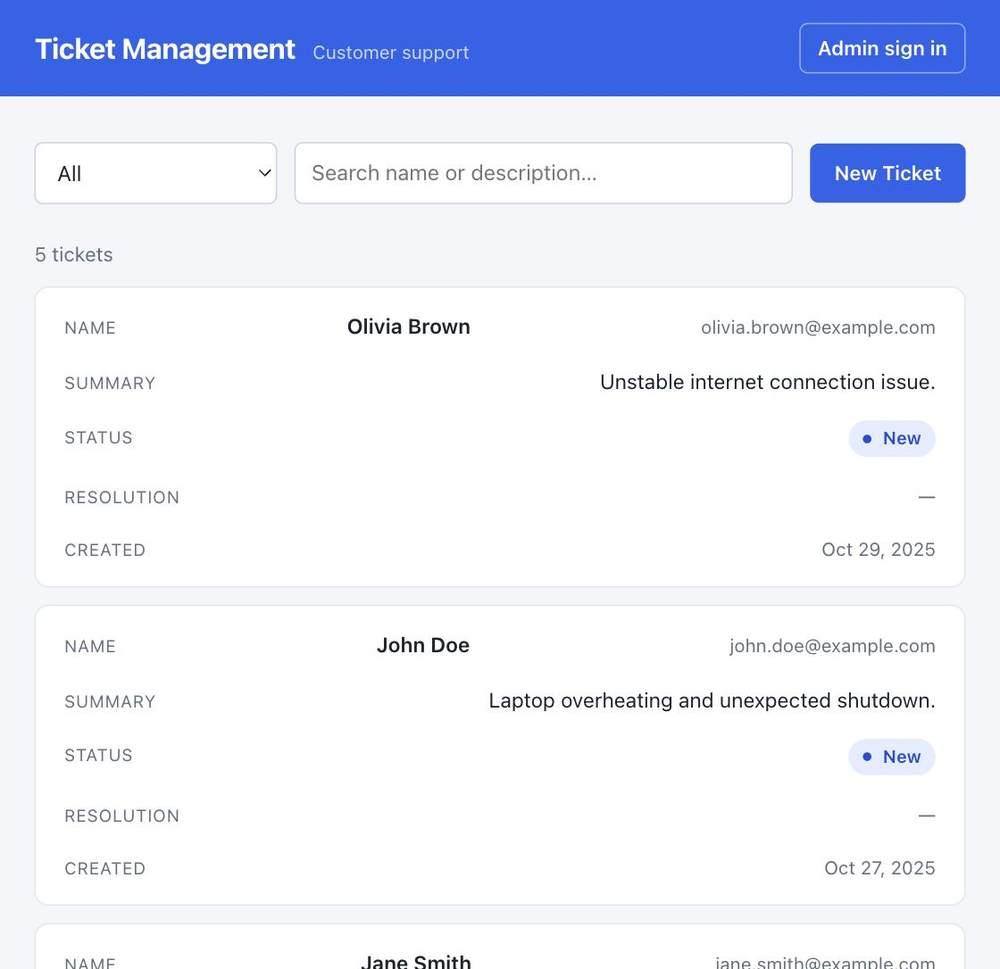
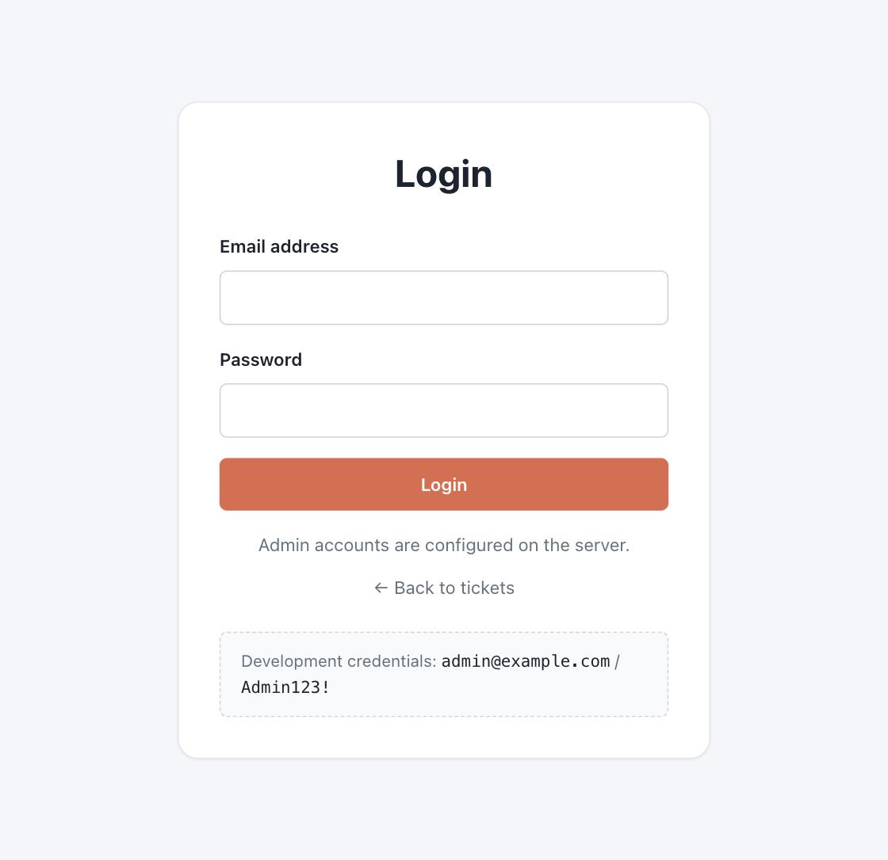

# Smart Customer Support System

A customer-support ticket system: anyone can file a ticket, an admin can triage it.
ASP.NET Core Minimal API backend, React frontend, tickets stored in the supplied
`dataset.json`.

Built for the exercise brief in **[EXERCISE.md](EXERCISE.md)**. The stage-by-stage
plan it was built to is in **[PLAN.md](PLAN.md)**.

---

## Quick start

Two terminals. No API keys, no database, no configuration.

```bash
# Terminal 1 — API on http://localhost:5099
dotnet run --project backend/MX.Api

# Terminal 2 — UI on http://localhost:5173
cd frontend && npm install && npm run dev
```

Open <http://localhost:5173>. Sign in with **`admin@example.com`** / **`Admin123!`**
to edit tickets. Simulated emails print to the API console.

**Prerequisites:** .NET SDK 9.0.200 or newer (the `.slnx` solution format needs it)
and Node.js 20+.

> If something already occupies port 5173, Vite moves to 5174 and everything still
> works — in development the API accepts any loopback origin.

---

## What it does

| | |
|---|---|
| **File a ticket** | Anonymous. Name, email, description, optional image. |
| **Track a ticket** | `/tickets/{id}` — the link sent in the confirmation email. Works on a cold load. |
| **Page through them** | 20 a page by default, or 10/50/100. Composes with the filters. |
| **Triage** | Admin only: change status, write a resolution. |
| **Notify** | An email on create, on status change, and on resolution change — and on nothing else. |
| **Summarise** | A one-line AI précis of each new ticket. |

### Screenshots

| Tickets list | Admin login |
|---|---|
|  |  |

Both were captured at a 700px-wide viewport, so the list shows the responsive card
layout rather than the wide table. Above 760px the same list renders as the table in
[`docs/ticket-manage.png`](docs/ticket-manage.png). Both predate the pager, which sits
below the last row.

---

## Running the tests

```bash
dotnet test          # 249 tests
```

```
MX.Application.Tests   100   use cases and domain rules, every port mocked
MX.Infrastructure.Tests 74   JSON persistence, password hashing, uploads, AI resilience
MX.Api.Tests            75   real HTTP through the real pipeline, temp dataset copy
```

The frontend is checked by its build — `cd frontend && npm run build` — which
type-checks the DTOs against what the API actually returns.

---

## Architecture

Four projects, with the dependency rule pointing inward. `MX.Domain` references
nothing at all, so business rules cannot leak into HTTP or storage concerns.

```
backend/
  MX.Domain          entities, domain events, the status vocabulary — zero dependencies
  MX.Application     use cases, DTOs, and the ports (interfaces) infrastructure implements
  MX.Infrastructure  the adapters: JSON store, email, AI, JWT, file storage
  MX.Api             Minimal API endpoints and the DI composition root
frontend/            Vite + React + TypeScript
```

This is enforced, not just intended: `ArchitectureTests` reads the compiled
assemblies and fails the build if `MX.Domain` ever references ASP.NET, or if
`MX.Application` reaches outward to Infrastructure. Those tests assert an *absence*,
so a positive control also asserts the probe sees real metadata — otherwise they
could pass by inspecting nothing.

### The patterns, and why each is there

| Pattern | Where | Why it earns its place |
|---|---|---|
| **Repository** | `JsonTicketRepository` | Isolates the file mechanics so services test without touching disk. |
| **Domain events** | `TicketCreated`, `TicketStatusChanged`, `TicketResolutionChanged` | The three email cases become three handlers, not three `if` blocks in the service. |
| **Strategy** | `IEmailSender`, `ISummaryGenerator` | Mock and real implementations swap by config, no call-site change. |
| **Decorator** | `ResilientSummaryGenerator` | Makes "must not throw, must not hang" true in one place. |
| **Result** | `Result<T>` | "Not found" and "invalid" are return values, so a 404 costs no stack trace. |
| **Options** | `JwtOptions`, `EmailOptions`, `AiOptions`, `StorageOptions` | Typed config; the integration tests point the app at a temp dataset through it. |

### Decisions worth knowing about

**The entity decides what counts as a change.** `ChangeStatus` and `SetResolution`
return whether anything actually changed and raise an event only if it did. That is
what makes "pressing Save twice does not email the customer twice" a property of the
model rather than something every caller must remember.

**`"In Progress"` has a space in it.** A plain C# enum cannot round-trip that, so
`TicketStatusJsonConverter` handles it and `TicketStatusNames` is the single place the
spelling lives — shared by the JSON store and the HTTP API so the two cannot drift.
`GET /api/tickets/statuses` serves that same list to the frontend, so the dropdowns
cannot drift either. A test rewrites the supplied `dataset.json` and requires the
bytes to come back identical, which pins the status spelling, the timestamp format,
property order, and character encoding all at once.

**The list is paged, and a bad page is a 400 rather than a guess.** `GET
/api/tickets` returns one page inside an envelope carrying `totalCount`, so the UI
can say "page 2 of 9" instead of only offering a "next". Two choices are worth
naming. `pageSize` is capped at 100 and an over-large value is *rejected*, not
clamped — silently returning a tenth of what was asked for is a bug that surfaces
as missing data much later. A page *past* the end, though, is an empty page and a
200: that is what happens when a filter shrinks the result under someone, and it
is not their mistake. The sort is stable, which paging depends on — two tickets
sharing a timestamp must not swap places between the request for page 1 and the
request for page 2, or one of them appears twice and the other never.

**Uploads are treated as hostile.** The stored filename is generated rather than taken
from the upload, which removes path traversal instead of filtering for it; the image
format is decided from the file's leading bytes, not its declared content type; and
the read is bounded so an oversized body is rejected before being buffered whole.

**Editing lives on the detail screen only.** `ticket-manage.png` shows status and
resolution editable inline in the table, but the brief's functional requirements put
editing on the detail view. One editing surface is easier to keep correct than two.

---

## Configuration

Everything ships working with no configuration. Each integration can be switched to
its real implementation independently.

### AI summaries — `Ai:Provider`

| Value | Behaviour |
|---|---|
| `Stub` *(default)* | Deterministic local truncation. No network, no key, no cost. |
| `Claude` | Calls the Anthropic API. Needs `Ai:ApiKey`. |
| `None` | Feature off. |

```bash
dotnet user-secrets set "Ai:ApiKey" "sk-ant-..." --project backend/MX.Api
# then set "Ai:Provider": "Claude" in appsettings.Development.json
```

A failure never costs more than the summary: `ResilientSummaryGenerator` applies a
timeout and turns any provider error into "no summary", so the ticket is still created.
Verified with a deliberately invalid key — the ticket returned 201 in under a second.

### Email — `Email:Provider`

| Value | Behaviour |
|---|---|
| `Mock` *(default)* | Logs the message to the console and records it in memory. |
| `Smtp` | Sends over SMTP via MailKit. |

```bash
dotnet user-secrets set "Email:Smtp:Username" "you@gmail.com" --project backend/MX.Api
dotnet user-secrets set "Email:Smtp:Password" "<16-char app password>" --project backend/MX.Api
```

> The SMTP path is implemented but has not been exercised against a live mail server.

### Auth

Development credentials live in `appsettings.Development.json` and are committed so the
exercise runs straight after a clone. The password is stored as a PBKDF2 hash, never
plaintext. No signing key ships in `appsettings.json` — startup fails with a clear
message if one is missing outside development.

```bash
dotnet user-secrets set "Auth:Jwt:SigningKey" "<32+ random characters>" --project backend/MX.Api
```

### Storage

`Storage:DataFilePath` defaults to `Data/dataset.json` relative to the API's content
root, so tickets you create show up in `git diff` — the persistence requirement is
visible rather than asserted. Uploaded images go to `wwwroot/uploads` and are served at
`/uploads/{file}`.

---

## API

| Method | Route | Auth | Purpose |
|---|---|---|---|
| `POST` | `/api/auth/login` | — | Email and password for a JWT. |
| `GET` | `/api/tickets?status=&search=&page=&pageSize=` | — | One page of the list, filtered. `status=All` or omitted means no filter. |
| `GET` | `/api/tickets/statuses` | — | The status vocabulary, for dropdowns. |
| `GET` | `/api/tickets/{id}` | — | One ticket by id. |
| `POST` | `/api/tickets` | — | File a ticket. `multipart/form-data` (with an optional `image`) or JSON. |
| `PUT` | `/api/tickets/{id}` | **admin** | Update `status` and/or `resolution`. |
| `GET` | `/uploads/{file}` | — | An uploaded image. |
| `GET` | `/health` | — | Liveness. |

Swagger UI is at `/swagger` in development. Failures come back as RFC 9457
ProblemDetails, the same shape ASP.NET produces for unhandled errors, so a client
parses one error format.

On `PUT`, omitting a field leaves it unchanged; sending `""` for `resolution` clears it.
That distinction is what lets status and resolution be edited independently.

The list endpoint answers with a page, not a bare array. `page` defaults to 1 and
`pageSize` to 20, with a maximum of 100; both are optional, so a client that ignores
paging still works and simply gets the first page.

```jsonc
{
  "items": [ /* … TicketDto … */ ],
  "page": 2,
  "pageSize": 20,
  "totalCount": 53,      // the whole match, not this page
  "totalPages": 3,
  "hasPreviousPage": true,
  "hasNextPage": true
}
```

```bash
# The second page of closed tickets, ten at a time
curl -s "http://localhost:5099/api/tickets?status=Closed&page=2&pageSize=10"
```

```bash
# File a ticket with an image
curl -X POST http://localhost:5099/api/tickets \
  -F "name=Ada Lovelace" -F "email=ada@example.com" \
  -F "description=The printer is on fire." -F "image=@photo.png"

# Sign in, then close a ticket
TOKEN=$(curl -s -X POST http://localhost:5099/api/auth/login \
  -H 'Content-Type: application/json' \
  --data-binary '{"email":"admin@example.com","password":"Admin123!"}' | jq -r .accessToken)

curl -X PUT "http://localhost:5099/api/tickets/$ID" \
  -H "Authorization: Bearer $TOKEN" -H 'Content-Type: application/json' \
  -d '{"status":"Resolved","resolution":"Replaced the drain pump."}'
```

---

## Known limitations

- **Paging is applied in memory, after the whole file is read.** The client is
  protected — a request can never ask for more than 100 rows — but the server is not:
  `JsonTicketRepository` has no way to fetch a slice, so a dataset large enough to
  strain the process still gets loaded whole on every list. Pushing `Skip`/`Take`
  down to the store is the same boundary a real database would cross, and the
  `ITicketRepository` port is where that change would land.
- **Concurrent writes** are serialised through a semaphore in a single process, and the
  file is replaced atomically so a crash cannot truncate it. That is correct for one
  instance and would not survive being scaled out — the point at which a real database
  earns its place.
- **The session token is kept in `localStorage`**, so a refresh does not sign the admin
  out mid-triage. It is readable by any script on the origin, which is an acceptable
  trade for short-lived tokens guarding sample data and would want revisiting otherwise.
- **The supplied dataset references images that were never shipped**
  (`uploads/laptop_issue.jpg` and friends), so those attachments 404. The UI says so
  rather than showing a broken-image icon.
- **The SMTP and Claude paths are implemented but unverified against live services** —
  both need credentials. Their failure paths are tested.
- **The responsive layout below 760px** is exercised in the screenshot above; the wide
  table was verified separately during development.
